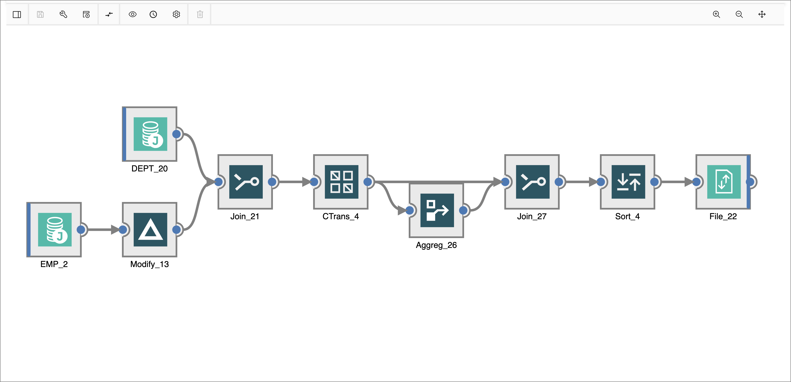

## Information Server Workshop

Welcome to our workshop! In this workshop we'll be using IBM Information Server to design data processing jobs with DataStage and create rules to analyze data.

* Get acquainted with Information Server
* Run a few DataStage jobs
* Learn the ins and outs of data rules
* Have fun!

## About Information Server

IBM InfoSphere Information Server is a market-leading data integration platform which includes a family of products that enable you to understand, cleanse, monitor, transform and deliver data, and to collaborate to bridge the gap between business and IT. InfoSphere Information Server provides massively parallel processing (MPP) capabilities to deliver a highly scalable and flexible integration platform that handles all data volumes, big and small.

## Credits

* [Steve Martinelli](https://github.com/stevemar)
* [Sandhya Nayak](https://github.com/sandhya-nayak)
