# Lab: Connect to BitBucket

You can integrate your Git server with IBM DataStage. This integration allows you to publish jobs and related artifacts to different Git branches and load other versions of a job from Git onto the IBM DataStage Flow Designer canvas.

Using IBM DataStage Flow Designer with Git provides the following benefits:

* Helps with Continuous Integration Continuous Delivery (CICD) pipeline automation. Your assets are easily available in Git and you can move them from the development (DEV) branch to quality assurance (QA) to production.
* Helps with auditing requirements. You can simply tell who changed what.
* You can map a version of a job in the XMETA repository to a version in Git.
* You can work on multiple versions of a job by creating temporary branches.
* You can easily roll back to a prior version of a job.

The following Git repositories are supported:

* Bitbucket
* GitHub
* GitLab
* Microsoft Team Foundation Server

> For more info check out the [Managing source control with Git](https://www.ibm.com/support/knowledgecenter/SSZJPZ_11.7.0/com.ibm.swg.im.iis.ds.fd.doc/topics/c_manage_source_control_github.html) documentation.

In this lab we'll learn how to integrate DataStage with BitBucket Cloud, a free to register BitBucket platform available at <https://bitbucket.org/>.

This lab consists of the following steps:

1. [Configure DataStage with BitBucket](#1-configure-datastage-with-bitbucket)
1. [Export DataStage assets to BitBucket](#2-export-datastage-assets-to-bitbucket)

## Before you start: Registering for BitBucket

Navigate to <https://bitbucket.org/> and click on the "Get it free" button and create an account.

Create a new repo, we'll call it `datastage-jobs`. Ensure the option to create a `README.md` file is selected.

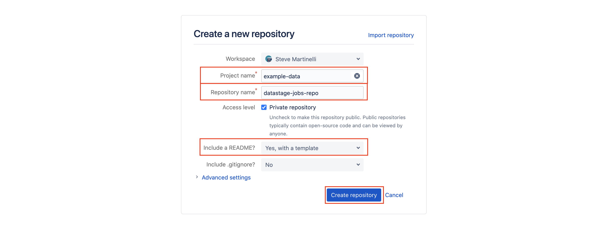

Your new repo should look like this:

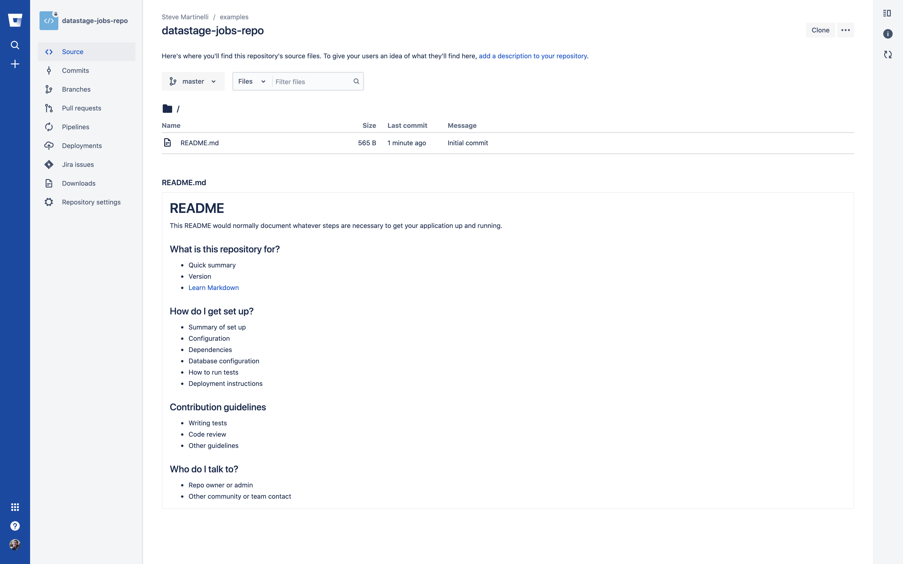

Generate an "App Password" by going to your ["Personal Settings"](https://bitbucket.org/account/settings/app-passwords/). Remmeber to give the application password the read/write permission for repositories.

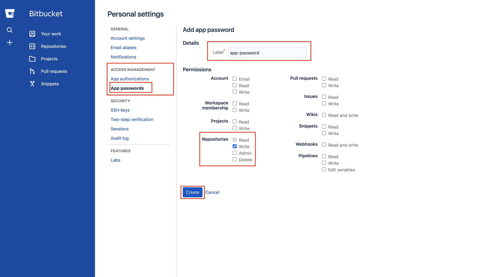

## Before you start: Launching DataStage Flow Designer

Before we start the lab, let's switch to the `iis-client` VM and launch `Firefox`.

Click on `Classic Launchpad` in the Bookmarks tab. The first time you try this out, you might see a certificate error. To get past it, click on `Advanced...` and then click `Accept the Risk and Continue`.

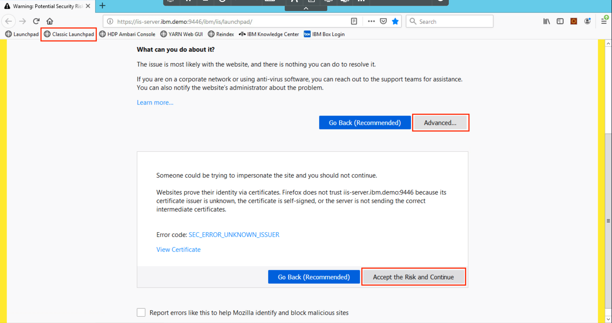

Click on `DataStage Flow Designer`.

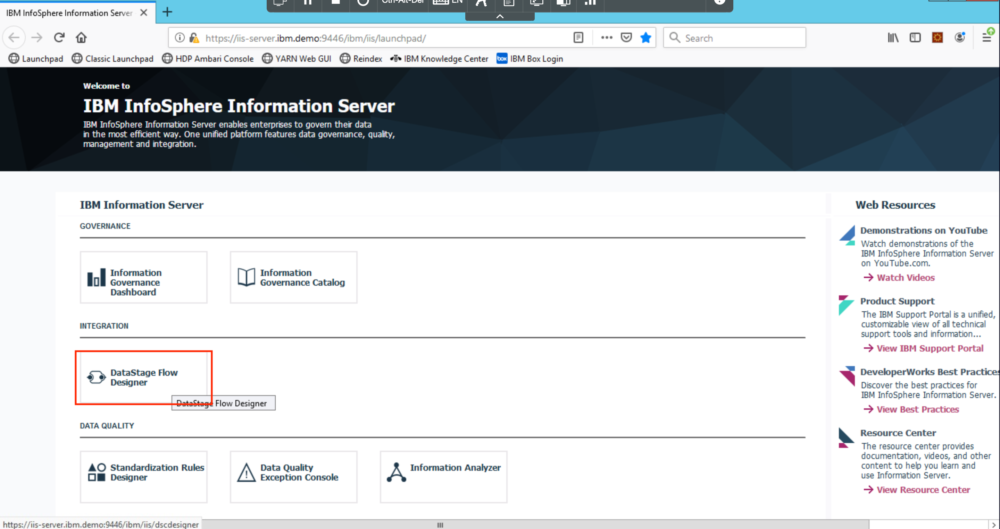

Login with the credentials `isadmin`/`inf0Xerver`.

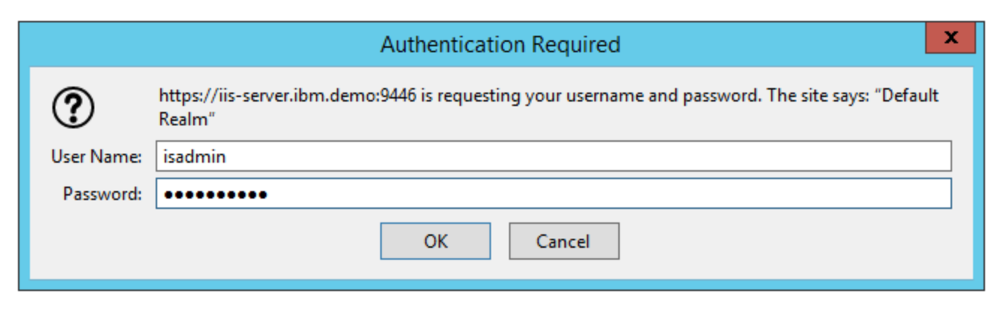

This brings up the `DataStage Flow Designer`. Click `OK`.

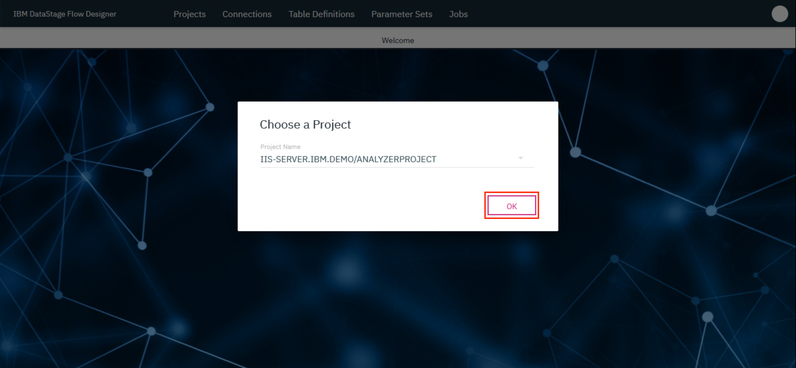

## 1. Configure DataStage with BitBucket

From the IBM DataStage Flow Designer, click on the username bubble on the top right. Choose the `Setup` option. We'll be configuring the `Server` and `User` options.

For the `Server` click on the `Git` tab and input the following:

* **Git repo**: Your new repo, i.e. `https://bitbucket.org:stevemart/datastage-jobs.git`
* **Clone repo path**: A new folder name, i.e. `bitbucket/stevemart/datastage-jobs`
* **Vendor**: BitBucket

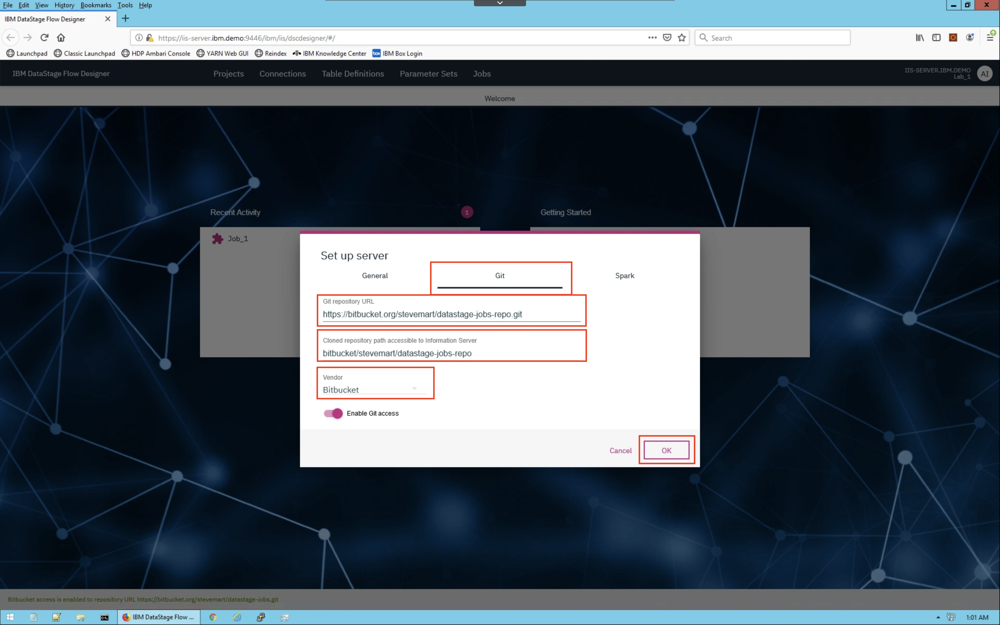

For the `User` configuration input the following:

* **Email address**: Your BitBucket email
* **Username**: Your BitBucket username
* **Personal access token**: Your BitBucket app password from the previous step

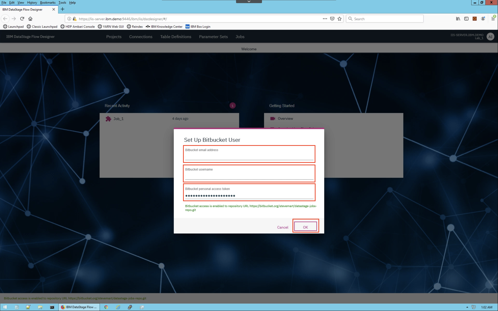

## 2. Export DataStage assets to BitBucket

Load up any existing job or create a new one. Once loaded, click on the `Export` button that looks like an upload arrow.

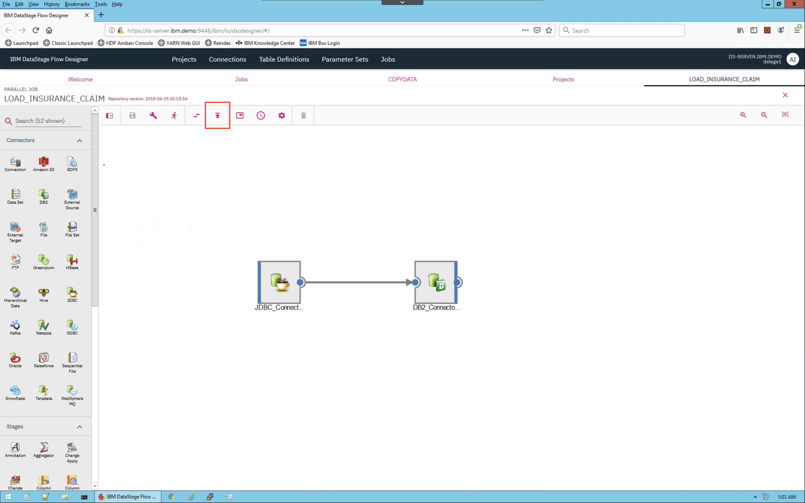

The entire DataStage project will be saved and exported to your configured BitBucket. Enter a specific commit message.

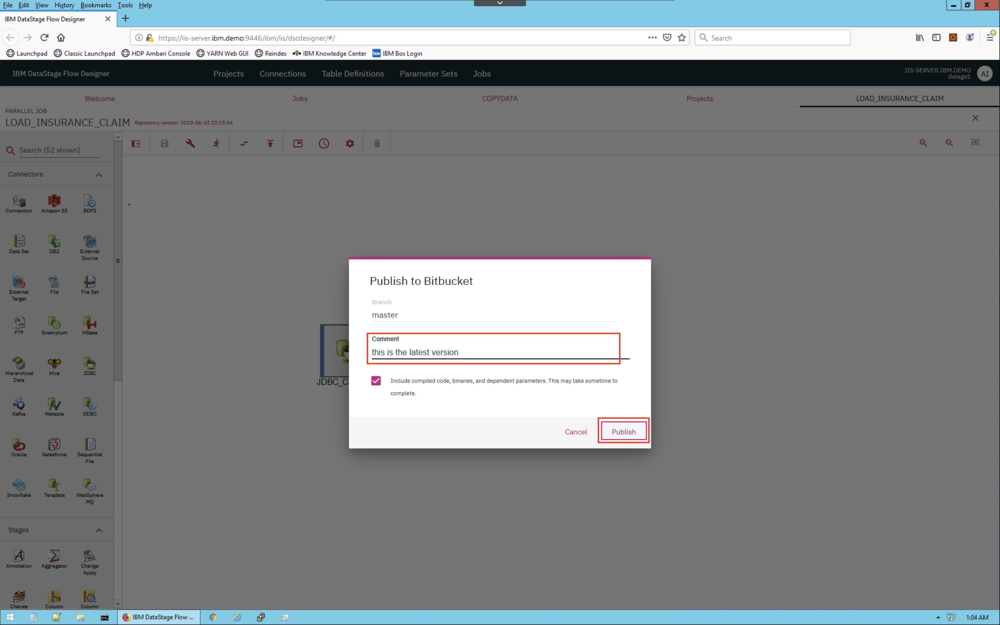

There will be a success message if everything was exported correctly.

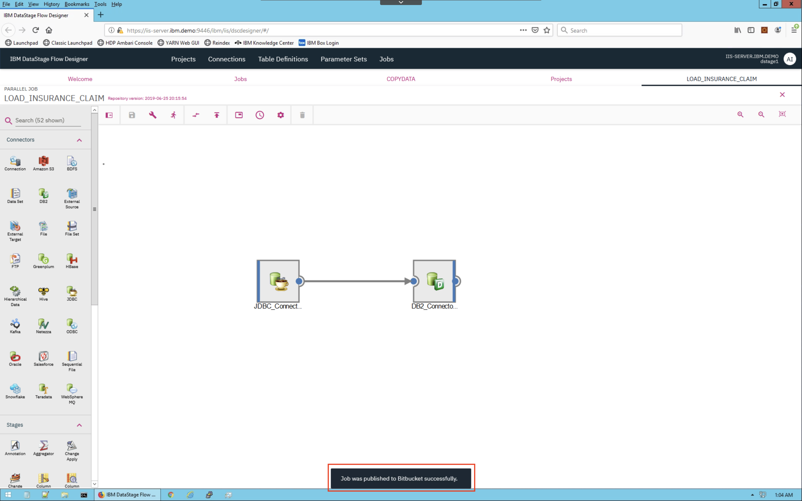

Navigate back to your BitBucket repository to see the exported files.

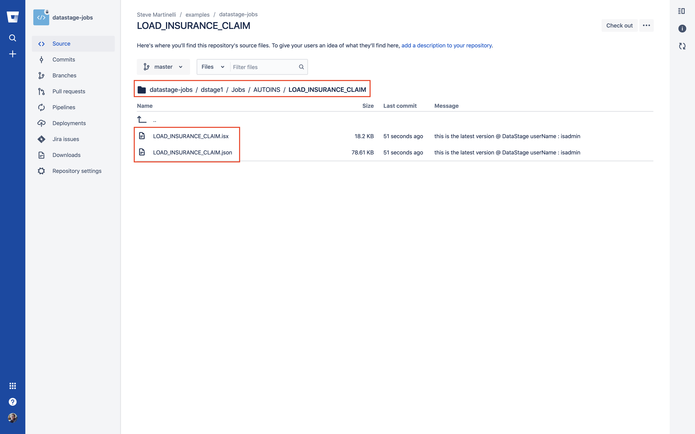

**CONGRATULATIONS!!** You have completed this lab!
