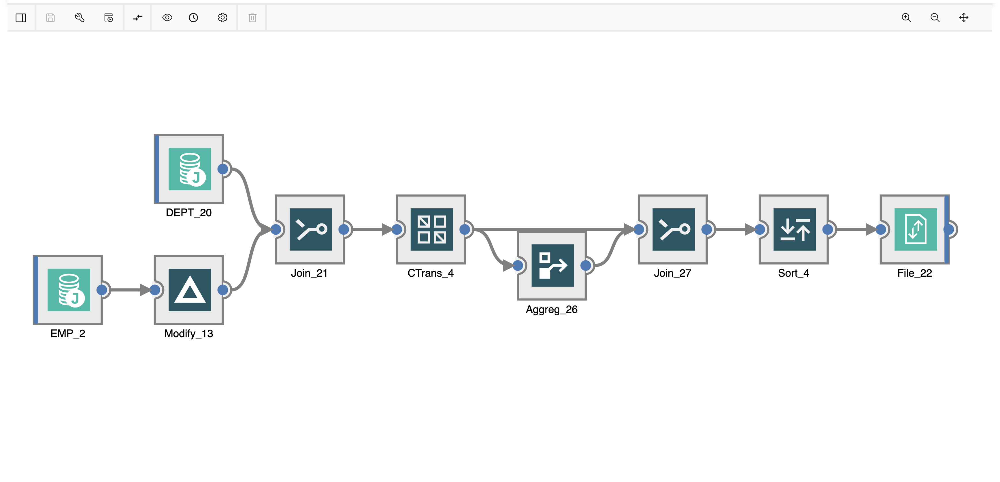

## Information Server: DataStage and Information Analyzer Workshop

Welcome to our workshop! In this workshop we'll be using IBM Information Server to design data processing jobs with DataStage and to analyze relationships in data using Information Analyzer.

* Get acquinted with Information Server
* Run a few DataStage jobs
* Learn the ins and outs of Information Analyzer
* Have fun!

## Agenda

|   |   |
| - | - |
| [Lab 0: Pre-work](pre-work/README.md) | Spin up your environment |
| [Lab 1: Intro to DataStage](lab-1/README.md) | Use DataStage to load, transform local data. Use Operation Console to debug jobs |
| [Lab 2: Information Analyzer](lab-2/README.md) | Use Information Analyzer to find relationships in data |
| [Lab 3: DataStage with Db2](lab-3/README.md) | Use DataStage to load from databases, perform calculations, and write to file |

## About Information Server

IBM InfoSphere Information Server is a market-leading data integration platform which includes a family of products that enable you to understand, cleanse, monitor, transform and deliver data, and to collaborate to bridge the gap between business and IT. InfoSphere Information Server provides massively parallel processing (MPP) capabilities to deliver a highly scalable and flexible integration platform that handles all data volumes, big and small.

### DataStage

A highly scalable data-integration tool for designing, developing and running jobs that move and transform data on premises and on the cloud.

### Information Analyzer

Provides data profiling and analysis to accurately evaluate the content and structure of your data for consistency and quality.

## Credits

* [Steve Martinelli](https://github.com/stevemar)
* [Sandhya Nayak](https://github.com/snyk)
