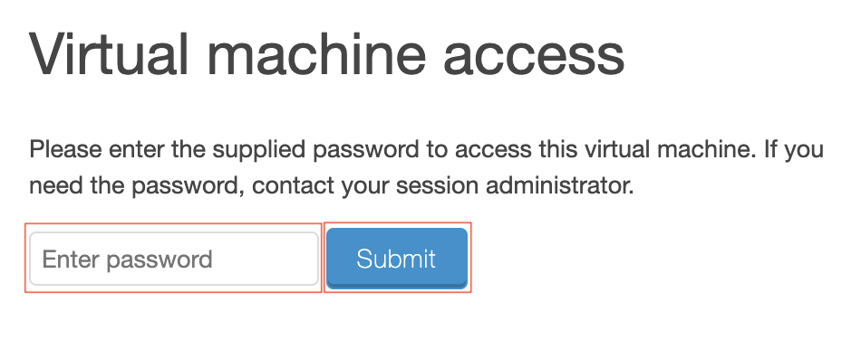
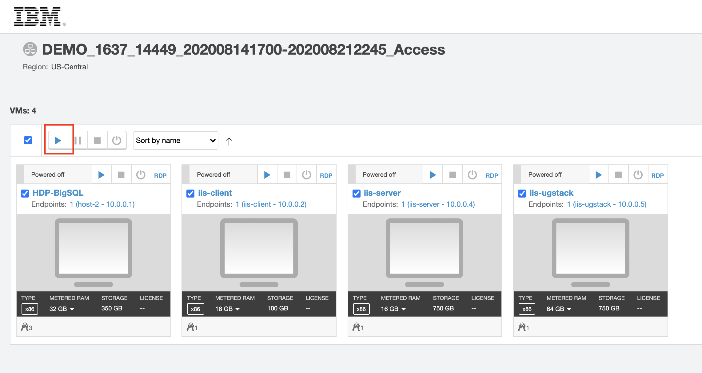
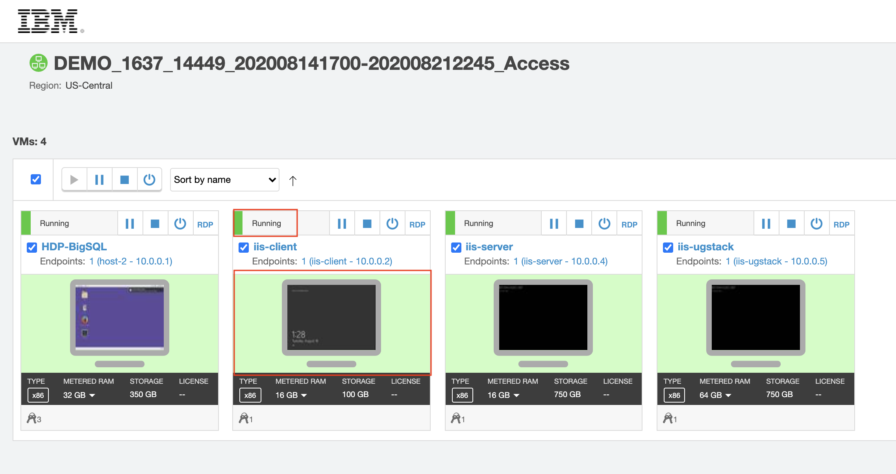

# Pre-work

This section will explain how to access your environment.

## Credentials

|   |   |   |
| - | - | - |
| Windows VM | `Administrator` | `inf0Xerver` |
| Linux VM | `root` | `inf0Xerver` |
| Information Server | `isadmin` | `inf0Xerver` |

## 1. Turn on your Skytap Environment

The lab instructors will provide everyone with a set of URLs at the beginning of the lab.

Accessing the URL will open a Skytap environment that is password protected.



Typing in the password provided by the lab instructor will give you access to 4 virtual machines. Turn the VMs on by clicking the "Play" button.



Once the VMs are turned on, click on the tile to access the virtual machine.



Use the toolbar at the top to make the window fullscreen. The "Ctrl-Alt-Del" button can be used to log into Windows environments.


> **NOTE**: The Skytap environment will automatically turn off the VMs if they are not used within two hours. You can simply start them again to resume your work.

## 2. Enable the Operations Console

Access the `iis-server` VM.

Log in with the credentials above. Run the following commands.

Change to the Information Server install path:

```bash
$ cd /opt/IBM/InformationServer/Server/DSODB
```

Edit the `DSODBConfig.cfg` file. set the `DSODBON` value to `1`. It should be the first value at the top of the file. Save your changes and exit your editor.

```ini
DSODBON=1
```

If you're not familiar with `vi` you can use `sed`

```bash
sed -i 's/DSODBON=0/DSODBON=1/g' DSODBConfig.cfg
```

Restart your console:

```bash
$ cd /opt/IBM/InformationServer/Server/DSODB/bin
$ ./DSAppWatcher.sh -start
```

## 3. Copy the data over

Access the `iis-server` VM.

Log in with the credentials above. Run the following commands.

Change to the right folder:

```bash
$ cd /IBMdemos
```

Download the data

```bash
$ wget http://ibm.biz/datastage-standalone-data
```

Unzip it:

```bash
$ unzip dataset.zip
```
