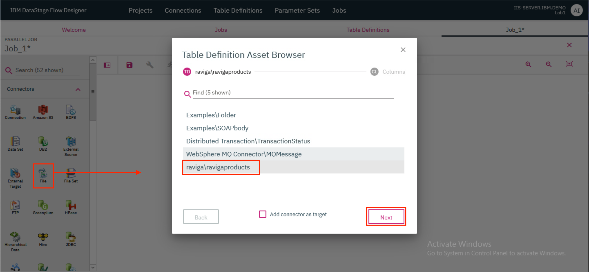
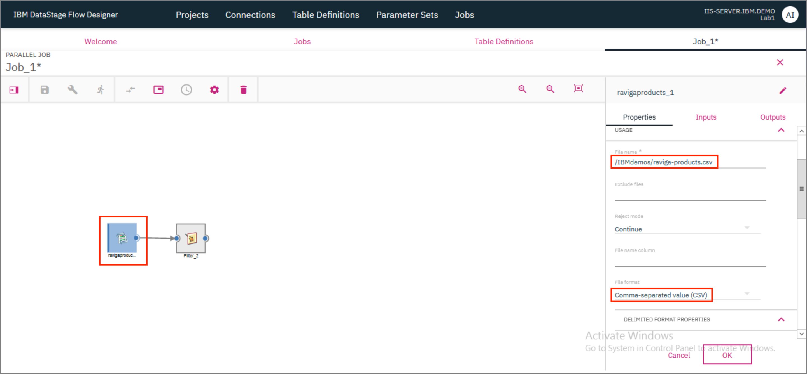
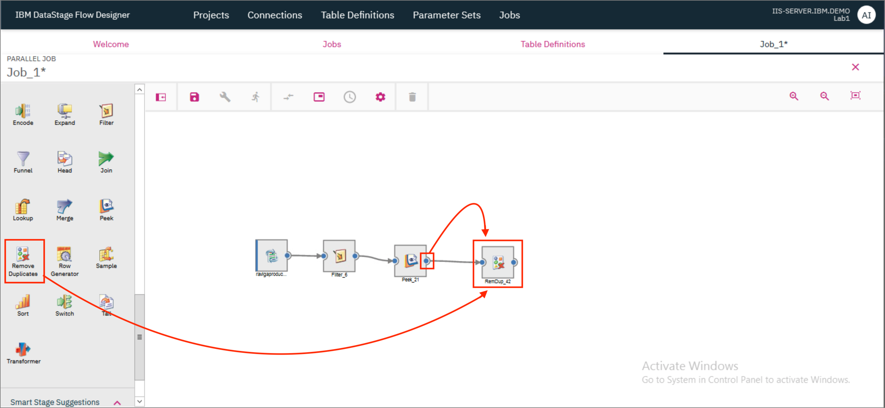
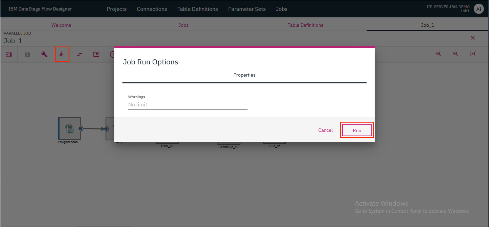
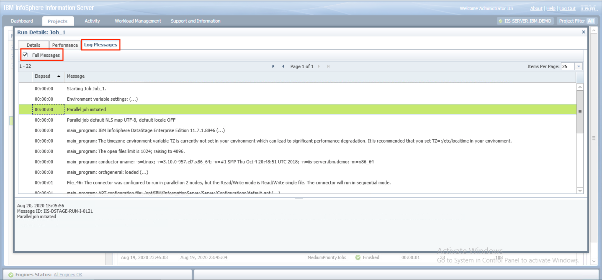

# Lab 1: Introduction to DataStage

DataStage Flow Designer enables users to create, edit, load, and run DataStage jobs which can be used to perform integration of data from various sources in order to glean meaningful and valuable information.

The purpose of this lab is to familiarize ourselves with the DataStage Flow Designer and the Operations Console.

In this lab, you will learn the following:

* How to create a job in DataStage.
* How to read tabular data from a file into DataStage.
* How to perform transformations (such as filtering out records and removing duplicate values) on a table.
* How to write tabular data from DataStage into a file.
* How to run jobs.
* How to view logs for jobs.
* How to schedule jobs.

This lab is comprised of the following steps:

1. [Create a Transformation project](#1-create-a-transformation-project)
1. [Create the table definition](#2-create-the-table-definition)
1. [Create the job](#3-create-the-job)
1. [Compile and run the job](#4-compile-and-run-the-job)
1. [Use Operations Console to view previous logs](#5-use-operations-console-to-view-previous-logs)
1. [Scheduling the job](#6-scheduling-the-job)
1. [View output](#7-view-output)

## Before you start

Before we start the lab, let's switch to the `iis-client` VM and launch `Firefox`.


Click on `Classic Launchpad` in the Bookmarks tab. The first time you try this out, you might see a certificate error. To get past it, click on `Advanced...` and then click `Accept the Risk and Continue`.


Click on `DataStage Flow Designer`.


Login with the credentials `isadmin`/`inf0Xerver`.


This brings up the `DataStage Flow Designer`. Click `OK`.


## 1. Create a Transformation project

* On the IBM DataStage Flow Designer, click on the `Projects` tab and click `+ Create`. In the modal that opens up, type in a name for the project and click `Create`.


The project takes a few minutes to be created and once ready, it will be visible on the `Projects` tab.


* Click on the tile for your newly created project. In the modal that opens up, verify that the name of your project is provided as the `Project Name` and click `OK` to switch the project.


## 2. Create the table definition

We will be using the raviga-products.csv file which was loaded as part of [Lab 0](/workshop/lab-0/README.md#3-copy-the-data-over). This file contains tabular data having 2 columns:

| Column Name | Data Type |
| - | - |
| ProductID | varchar(9) |
| Zip | Integer(6) |

* On the DataStage Flow Designer, click on the `Table Definitions` tab and then click `+ Create`. In the modal that opens up, provide the definition of the table contained in the input file. Go to the `General` tab and provide the *Data source type* as `File`, the *Data source name* as `raviga` and the *Table/File name* as `ravigaproducts`. If you wish to, you can also provide optional *Short description* and *Long description*.


* Next, go to the `Columns` tab and click `+ Add`. A new entry is added in the table. Edit the entry and update the *Column name* to `ProductID`. Mark the column as *Key*. Update the *SQL type* to `Varchar` and the *Length* to `9`.

* Click on `+ Add` to add another entry in the table. Edit this entry and update the *Column name* to `Zip`, *SQL type* to `Integer`, *Extended* to `"" (blank)` and *Length* to `6`. Mark the column as *Nullable*. Click `OK`. In the modal that pops up, click `Save`.


## 3. Create the job

* Click on the `Jobs` tab and then click `+ Create`. Click `Parallel Job`.


A new tab with the name `Job_1*` opens up where you can now start designing the parallel job.

Before designing the job, take a few minutes to look at the various buttons and menus available on the screen.

1. The `Show/Hide Palette` button can be used to show or hide the palette on the left of the screen which contains the connectors and stages that can be used while designing the job.

2. The `Save`, `Compile` and `Run` icons are used to save, compile and run the job respectively.

3. The `Compare` icon is used to compare this job with another job in the Project.

4. The `View` menu has the following options:

    1. View OSH code - which is available once the job has been successfully compiled.
    2. View log - which is available once the job has been run.
    3. Properties - based on what is selected in the job canvas before clicking on `Properties`, either the properties of the job or of a connector/stage/link are displayed.

5. The `Schedule` icon is used to set a schedule to run the job.

6. The `Settings` menu has a number of options such as

    1. Apply horizontal layout - which arranges all the connectors and stages in the canvas in a horizontal manner with data flowing from left to right.
    2. The ability to view/hide annotations, arrows, link names, and the type of the connector/stage.
    3. Smart palette - which applies smart logic based on usage patterns to reorder the items available in the palette. If disabled, the items in the palette are displayed in an alphabetical order.
    4. Smart stage suggestions - applies smart logic based on usage patterns to suggest the next stage that you might want to add to the job.


* Drag a ***File*** connector to the canvas. The `Table Definition Asset Browser` opens up. Select `raviga\ravigaproducts` and click `Next`.



* Ensure that both the columns `ProductID` and `Zip` are selected and click `Add to Job`.


* The ***File*** connector should now be visible on the canvas. Drag and drop a ***Filter*** stage on the canvas. Provide the output of the ***File*** connector as the input to the ***Filter*** stage. To do this, click on the little blue dot on the right side of the ***File*** connector and drag the mouse pointer to the ***Filter*** stage.

**NOTE**: For another method to connect the ***File*** connector to the ***Filter*** stage, click on the ***File*** connector to select it and then drag and drop the ***Filter*** stage. The ***Filter*** stage will automatically be connected to the ***File*** connector.


* Double click on the ***File*** connector to open the Connector's Properties page. Provide the *File name* as `/IBMdemos/raviga-products.csv` which is where the source file is located. Further down, provide the *File format* as `Comma-separated value (CSV)`.



* Scroll further down and update the *Null value* to `""`. Click `OK`.


* Double click the ***Filter*** stage to open the Stage's Properties page. Provide the value for *Where Clause* as `Zip IS NOT NULL`. This will filter out all the records in the table where the value of Zip is NULL. Click `OK`.


* We will use the ***Peek*** stage to look at the intermediate state of the table. Drag and drop a ***Peek*** stage to the canvas and provide the output of the ***Filter*** stage as the input to the ***Peek*** stage.


* Next, we will add a ***Remove Duplicates*** stage and provide the output of the ***Peek*** stage as the input to the ***Remove Duplicates*** stage.



* Double click on the ***Remove Duplicates*** stage to open the Stage's Properties page. Under *KEYS THAT DEFINE DUPLICATES*, select `Zip`. Set the value of *Duplicate to retain* as `First`. This will ensure that if there are any duplicate Zip values, the job will only retain the first record out of the records where this Zip value occurs. Click `OK`.


* Drag and drop a ***File*** connector to the canvas. In the modal that opens up, check the `Add connector as target` checkbox and click `Add to Job`.


* Provide the output of the ***Remove Duplicates*** stage as the input to the ***File*** connector. Double click the ***File*** connector to open the stage page, and provide the *File name* as `output.csv`. Specify `Comma-separated value (CSV)` as the *File format*. Click `OK`.


## 4. Compile and run the job

* Click the `Save` icon to save the job. If you wish to, you can provide a different name for the job in the modal that pops up. Click `Save`. Once the job is saved, click on the `Compile` icon to compile it. If compilation is successful, you should see a green check mark and the message `Compiled successfully` displayed on the screen. The OSH Code will also be available for viewing.


If the compilation was not successful, you should see a red error icon and the message `Compiler failed with ### errors.` where ### represents the number of errors. Clicking on `View errors` brings up a modal that lists all the errors that were found. The stage/connector/link that has the error is also highlighted in the canvas and you can hover over it to see the error.


* Click the `Run` icon to run the job. In the modal that opens up, click `Run`.



* Once the run completes, you should see the status of the run on the screen. The status will also indicate if there were any warnings or errors. Click on `View log` to get more details about the run.


* Everything that happens as part of the job run is available in the log. This includes warnings, errors and informational messages such as the results of the ***Peek*** stage. Scroll through the log to reach the Peek results. By default, the ***Peek*** stage only logs the first 10 records of the partition (the data was split into two partitions in this case). You can see how in both ***Peek*** logs there are no records where Zip value is NULL.


## 5. Use Operations Console to view previous logs

* At the bottom of the log, click on `Open Operations Console`. Alternatively, you can open the `Classic Launchpad` in Firefox and click on `Operations Console`.


* The Operations console can be used to view logs for previous runs of the job. Switch to the `Projects` tab. In the left-hand navigation pane, expand `Lab1` (the transformation project), followed by `Jobs`. Click on `Job_1` (the job that was just saved/compiled/run). The `Job Runs` table at the bottom of the screen will be updated to reflect all the times that the job was run. Click on any job run in the list to select it and click `View Details`.


* Go to the `Log Messages` tab and check the `Full Messages` checkmark to see the complete log for the job run. Clicking on an entry in the job log will display the log message details at the bottom.



## 6. Scheduling the job

DataStage Flow Designer provides the ability to run jobs as per a schedule.

* Back in the DataStage Flow Designer where we were designing the job, click on the `Schedule` icon. In the modal that opens up, provide the frequency for running the job - whether you want to run it every `Day`, `Week` or `Month`. Next to it, provide the time of the day when the job should run. Click `Schedule`.


Alternatively you can go up one level to the `Jobs` tab, and hover over your job's tile to see the kebab icon (⋮). Click on the icon and select `Schedule` to open up the scheduling modal where you can set up a schedule for your job.


**NOTE**: You can only schedule your job once it has been successfully compiled.

## 7. View output

* The output file will be saved on the server. Switch to the server VM by clicking the first icon on the `Environment VMs panel` and selecting `iis-server`. Login as the `root` user with the password `inf0Xerver`.


* CD to the location where you had stored the file. If you provided a path starting at "/", then it will be stored at that location in the server. Since we had only provided `output.csv` as the file path in the ***File*** connector, the file will be available in the Transformation project's folder, i.e.,

```ini
/opt/IBM/InformationServer/Server/Projects/<project-name>/
```


**CONGRATULATIONS!!** You have completed this lab!
