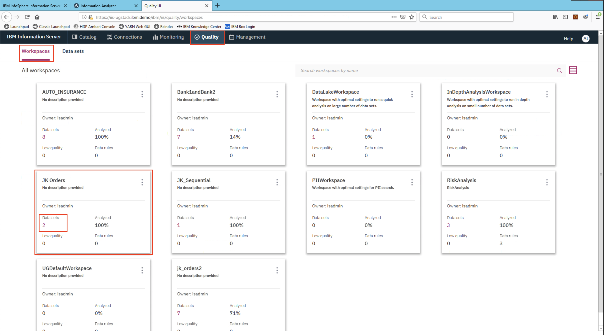
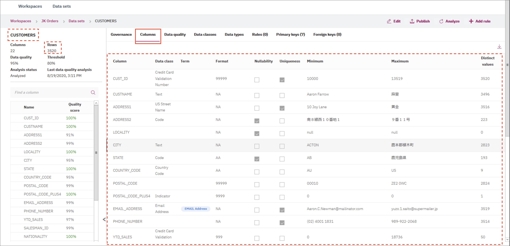
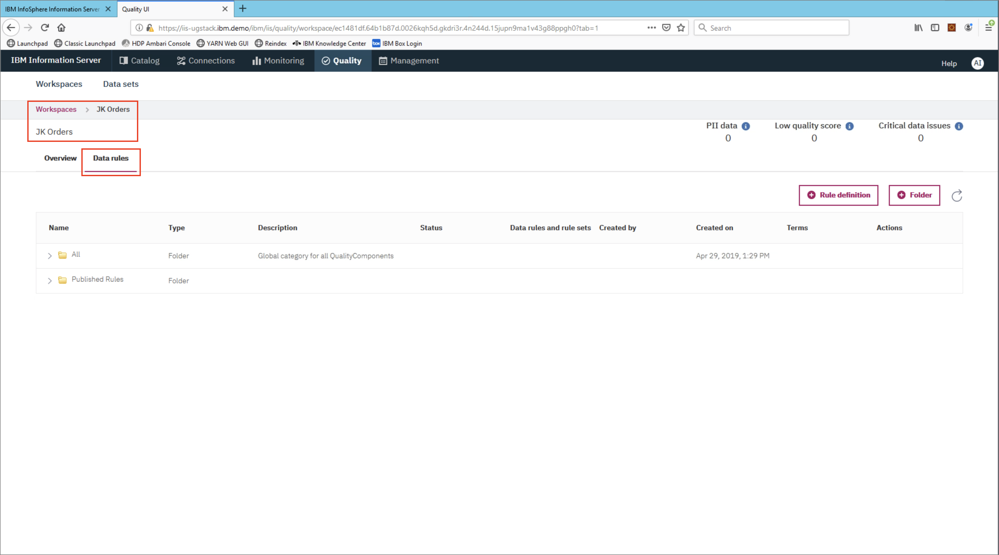
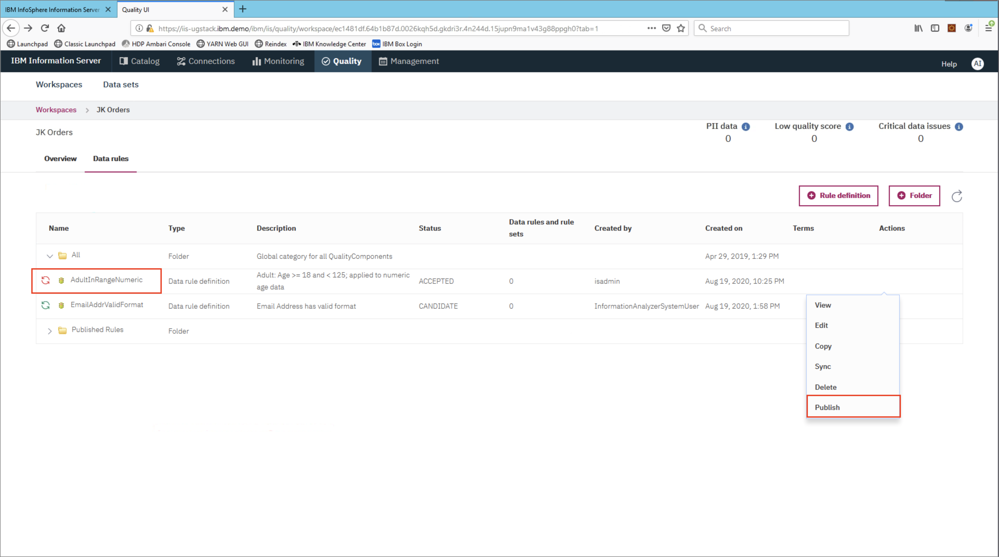

# Information Analyzer Data Exploration and Discovery

Information Analyzer (IA) enables users to better understand their data. It can automatically profile, classify, validate, and govern, data, upon discovery of new sources. It uses pre-built and custom rules that will apply meaning and quality measurements, which are available for users of the data and interested parties.

This lab, will give you hands-on experience using Information Analyzer and the Information Governance Catalog. In this lab, you will learn the following:

* How to create a data rule
* Apply the rule to a data set
* View data that does not apply to the rule

This section is comprised of the following steps:

* [1. Import and view the data](#1-import-and-view-the-data)
* [2. Create a data rule](#2-create-a-data-rule)
* [3. Re-analyze and view results](#3-re-analyze-and-view-results)

## 1. Import and view the data

Launch Firefox and click on the `Launchpad` bookmark. When the Information Server launchpad shows up click on the `Information Governance Catalog New` tile.


Log in with the username `isadmin` and password `inf0Xerver`.


The Information Governance Catalog overview page will appear.


Click on the `Connections` tab and ensure the connection `JK_ORD` appears and the host is `IIS-SERVER.IBM.DEMO`. This connection is pre-established for convenience and was imported to the `JK Orders` workspace, let's take a look at it.


To find the `JK Orders` workspace, go to `Quality` tab and click on the right tile.



The workspace overview will load. Take a few moments to browse the graphics on the page and click on the `Data sets` link to view the data in this exercise.


Before we create new rules let's look at the two data sets that will be used in this example. Take a look at the `Sales` data set first.


Click on the `Columns` tab to view findings from the analyzer. It found many things when the data was imported, like maximum and minimum values, distinct values, format, and uniqueness.


Repeat the same for the `CUSTOMERS` data set.



We're now ready to create our first data rule!

## 2. Create a data rule

From the `JK Orders` workspace click on the `Data rules` tab.



Expand the `Published Rules` section, then the `01 Personal Identity` section, and then the `Age` section to reveal the `AdultInRangeNumeric` rule.

Navigate to the right to show the `⋯` menu. Choose the `Manage in workspace` option from the menu.


The rule should now appear under the `All` section. Navigate to the right to show the `⋯` menu. Choose the `Edit` option from the menu.


Now we're going to edit the rule so that it flags ages that are under 18 or over 120. To do that, edit the text boxes to the right that show `minage` and `maxage` and update them with `18` and `120` respectively. The formula at the bottom should read:

```ini
age >= 18 and age < 120
```

Save the rule.


When you are brought back to the `Data rules` tab you'll notice that the new rule has an error. We need to publish the rule. To do so navigate to the right to show the `⋯` menu. Choose the `Publish` option from the menu.



Confirm the publish action.


## 3. Re-analyze and view results

* Click on the "2 data sets"
* See SALES and CUSTOMERS
* Kebab menu for SALES, click analyze
* See items that violated the rule
