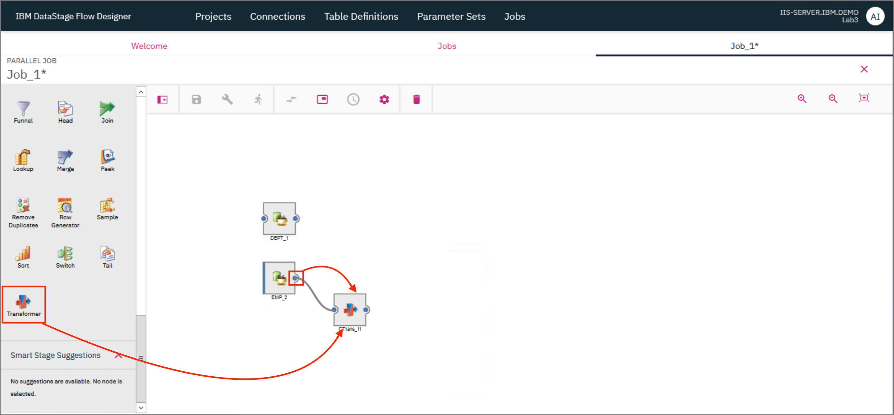
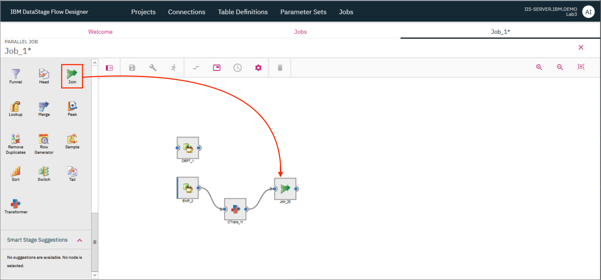
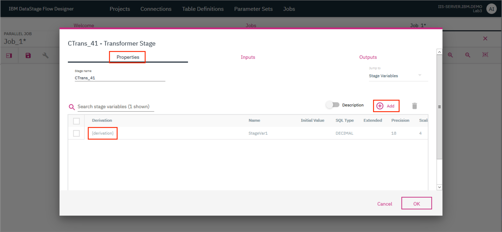
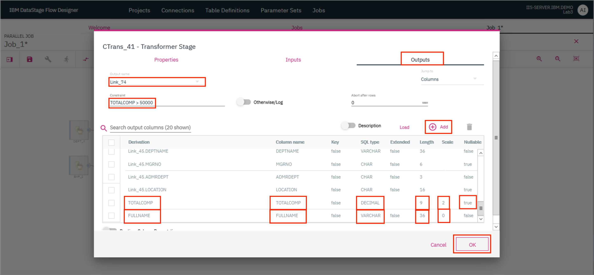
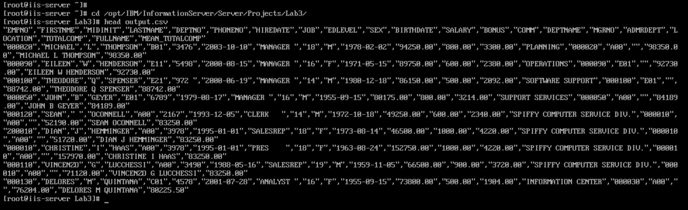

# Lab 3: DataStage with Db2

As a data engineer, you have been asked by the Line of Business that you support, to produce a new data file that contains all employees whose total compensation is less than $50,000. The file must also contain the Department Name that the employee works in, and the mean average salary of all employees in that department who earn less than 50,000. In addition, the file must be sorted in descending order, based on the mean average salary amount. Finally, the application that will consume this file, expects the full name of the employee to be in one field, formatted as first, middle initial, last).

**Notes:**

> 1. The input tables: `EMP` (containing employee data) and `DEPT` (containing department data) are already loaded in Db2 Warehouse. The connection details are provided in these steps.
> 2. Table `EMP` uses column `WORKDEPT` and table `DEPT` uses column `DEPTNO` to identify the department number.
> 3. We'll create the output file in the following directory: `/opt/IBM/InformationServer/Server/Projects/Lab3/`.
> 4. You can use the ***Peek*** stage to check intermediate results in the job as demonstrated in the previous lab.

This lab is comprised of the following steps:

1. [Create a Transformation project](#1-create-a-transformation-project)
1. [Add Db2 connection](#2-add-db2-connection)
1. [Create a job](#3-create-a-job)
1. [Compile and run the job](#4-compile-and-run-the-job)
1. [View output](#5-view-output)

## 1. Create a Transformation project

* On the IBM DataStage Flow Designer, click on the `Projects` tab and click `+ Create`. In the modal that opens up, type in a name for the project and click `Create`.


The project takes a few minutes to be created and once ready, it will be visible on the `Projects` tab.


* Click on the tile for your newly created project. In the modal that opens up, verify that the name of your project is provided as the `Project Name` and click `OK` to switch the project.


## 2. Add DB2 connection

* Click on the `Connections` tab and then click `+ Create` to add a new connection.


* Provide the following connection details and click `OK`. Click `Save` on the new modal that pops up.

```ini
Name: DB2WH
Connector type: JDBC
URL: jdbc:db2://db2w-kzwbsid.us-east.db2w.cloud.ibm.com:50001/BLUDB:sslConnection=true;
Username: bluadmin
Password: ****************
```


A tile for the new connection will now be displayed in the `Connections` tab.


## 3. Create the job

* Click on the `Jobs` tab and then click `+ Create`. Click `Parallel job`.


A new tab with the name `Job_1*` opens up where you can now start designing the parallel job.

* First, drag a ***Connection*** connector to the canvas. In the modal that opens up, select the `DB2WH` connection that was created earlier and click `Next`.


* On the next screen, select the `BLUADMIN` schema and click `Next`.


* On the next screen, select the `DEPT` table and click `Next`.


* On the next screen, click `Add to Job`.


* Drag another ***Connection*** connector to the canvas and repeat the steps given above but this time, select the `EMP` table instead. Once you complete the steps, you should see the two ***Connection*** connectors on the canvas.


Use a ***Transformer*** stage to perform the following two modifications:

1. Update the output of the `EMP` table by replacing any NULL `MIDINIT` values with `" "`. This is needed for a future step where we will combine the FIRSTNME, MIDINIT and LASTNAME columns to create the FULLNAME of the employee.
2. Currently, the `EMP` table uses the `WORKDEPT` column to identify the department number whereas the `DEPT` table uses the `DEPTNO` column. Modify the output of the `EMP` table by changing the name of the `WORKDEPT` column to `DEPTNO`. This is needed for a future step where we will ***Join*** the two tables.

* Drag and drop a ***Transformer*** stage next to the ***Connection*** connector for the `EMP` table. Provide the output of the `EMP` table ***Connection*** connector as the input to the ***Transformer*** stage. For this, click on the little blue dot on the right side of the ***Connection*** connector and drag the mouse pointer to the ***Transformer*** stage.



* Drag and drop a ***Join*** stage to the canvas and provide the output of the ***Transformer*** stage as the input to this ***Join*** stage.



* Double click on the ***Transformer*** stage to open up the stage page. In the `Properties` tab, click `+ Add`. A new entry is added in the table below. Use this to define a "Stage variable" (a local variable that is available only within this stage) named `MIDINITIAL` which will represent the middle initial of the employee with any NULL values replaced with the empty string. Double click on `{derivation}` to open up the Derivation Builder.


* Begin building the derivation rule for `MIDINITIAL` by finding the `NullToValue` function in the table. Clicking on the entry in the table will insert it in the "Derivation" at the top. You can also use the search bar to look for the function. Replace the `%input_column_input_column%` with the \<Link\>.MIDINIT input variable which can also be found in the table and the `%value%` with `" "`. \<Link\> represents the identifier of the input link for the transformer. Click `OK` to go back to the Stage page.


* Update the *Name* of the stage variable to *MIDINITIAL*, the *SQL type* to *Char*, the *Precision* to *1* and the *Scale* to *0*.


* Now go to the `Outputs` tab and in the table find the entry for the `MIDINIT` column. Double click on the derivation value for this entry (it will open up the Derivation builder) and change the rderivation value to use the newly created `MIDINITIAL` stage variable instead. Next, look for the entry for the `WORKDEPT` column. Double click on the `WORKDEPT` value under the `Column name` column and replace the text with `DEPTNO`. Click `OK`.


* Both the tables now have a column called `DEPTNO` which can be used to join the tables. Provide the output of the `DEPT` table ***Connection*** connector as the second input to the ***Join*** stage. Double clicking the ***Join*** stage brings up the stage page where you can verify that the `DEPTNO` is being used as the `JOIN KEY` and the `Join Type` is `Inner`.


* Next, add a ***Transformer*** stage to the canvas and provide the output of the ***Join*** stage as the input to the ***Transformer*** stage.


* Double click the ***Transformer*** stage to open the stage page. We will add 2 stage variables to this ***Transformer*** stage. In the `Properties` tab, click `+ Add`. A new entry is added in the table below. Use this to define a stage variable named `TOTALCOMP` which will represent the total compensation (the sum of bonus, commission and salary) of the employee. Double click on `{derivation}` to open up the Derivation Builder.



* Build the derivation rule for TOTALCOMP by finding the `BONUS`, `COMM` and `SALARY` input columns in the table. Clicking on the entries in the table will insert them in the "Derivation" at the top. Type in `+` signs between them in order to complete out the derivation. You can also use the search bar to look for the fields. When inserted in the "Derivation", the column names will be prepended with the identifier for the input link. Click `OK` to go back to the Stage page.


* Update the *Name* of the stage variable to *TOTALCOMP*, the *SQL type* to *Decimal*, the *Precision* to *9* and the *Scale* to *2*.


* Repeat the process above to add another Stage variable `FULLNAME` which will represent the complete name of the employee. Provide the *Derivation* as `CompactWhiteSpace(<Link>.FIRSTNME:" ":<Link>.MIDINIT:" ":<Link>.LASTNAME)`, the *Name* of the stage variable as *FULLNAME*, the *SQL type* as *Varchar* and the *Precision* as *36* and the *Scale* as *0*. Click `OK` to save the changes and return to the canvas.

***NOTE:*** \<Link\> needs to be replaced with the identifier of the input link. *CompactWhiteSpace* is a function that will compact any continuous white spaces into a single white space. `:` is the operator used for concatenation.


* Next, add a ***Join*** stage and an ***Aggregator*** stage to the canvas. Connect the ***Transformer*** stage to both these stages such that the output of the ***Transformer*** stage is provided as the input to both these stages.


Since the output links have now been added, we can provide the 2 stage variables `TOTALCOMP` and `FULLNAME` as outputs of the ***Transformer*** stage and once that is done, these values will be available as inputs in the subsequent stages.

* Double click on the ***Transformer*** stage to open the stage page. Go to the `Outputs` tab. Click on `+Add` twice to add 2 new entries in the table. Update one entry with the *Derivation* value as *TOTALCOMP*, the *Column name* as *TOTALCOMP*, the *SQL type* as *Decimal*, the *Precision* as *9*, the *Scale* as *2* and set *Nullable* to *true*. Update the second entry with the *Derivation* value as *FULLNAME*, the *Column name* as *FULLNAME*, the *SQL type* as *Varchar*, the *Precision* as *36* and the *Scale* as *0*.

* We also need to add a *Constraint* here, which will ensure that only the records with `TOTALCOMP` more than 50000 are sent in the output. Click on the empty space under `Constraint` to open up the Derivation Builder. Specify the derivation as `TOTALCOMP>50000`.

* Switch to the second output link by clicking on the `Link_<number>` under *Output name* and repeat the above steps to add the 2 stage variables to the output and to add the constraint. Click `OK` to save the changes and return to the canvas.



* Provide the output of the ***Aggregator*** stage as the input to the ***Join*** stage. Double click on the ***Aggregator*** stage to open the stage page. Select `DEPTNAME` as the grouping key.


* Scroll down to the *Aggregations* and select the *Aggregation Type* as `Calculation`, *Column* as `TOTALCOMP`, *Calculation Type* as `Mean Value` and click `Add Calculation +`.


* Go to the `Outputs` tab and verify that you can see 2 output columns - `MEAN_TOTALCOMP` and `DEPTNAME`. Click `OK` to save the changes and return to the canvas.


* Drag and drop a ***Sort*** stage on the canvas and provide the output of the ***Join stage*** as the input of the ***Sort*** stage.


* Double click on the ***Join*** stage to open the stage page. On the `Properties` tab, verify that the *Join Key* is `DEPTNAME` and the *Join Type* is `Inner`.


* Go to the `Outputs` tab and verify that you can see `FULLNAME` and `MEAN_TOTALPAY` in the output column list.


* Double click on the ***Sort*** stage to open up the stage page. Specify the *Sorting Key* as `MEAN_TOTALCOMP` and the *Sort Order* as `Descending`. Click `OK`.


* Drag and drop a ***File*** connector to the canvas. In the modal that opens up, check the `Add connector as target` checkbox and click `Add to Job`.


* Provide the output of the ***Sort*** stage as the input to the ***File*** connector. Double click the ***File*** connector to open the stage page, and provide the name of the output *File* as `output.csv`. Specify `Comma-separated value (CSV)` as the *File format*. Enable `First row is header` and provide *Null value* as `""`. Click `OK`.


## 4. Compile and run the job

* Click the `Save` icon to save the job. If you wish to, you can provide a different name for the job in the modal that pops up. Click `Save`. Once the job is saved, click on the `Compile` icon to compile it. If compilation is successful, you should see a green check mark and the message `Compiled successfully` displayed on the screen.


* Click the `Run` icon to run the job. In the modal that opens up, click `Run`.


## 5. View output

* The output file will be saved on the server. Switch to the server VM by clicking the first icon on the `Environment VMs panel` and selecting `iis-server`. Login as the `root` user with the password `inf0Xerver`.


* CD to the location where you had stored the file. If you provided a path starting at "/", then it will be stored at that location in the server. Since we had only provided `output.csv` as the file path in the ***File*** connector, the file will be available in the Transformation project's folder, i.e.,

/opt/IBM/InformationServer/Server/Projects/\<project-name\>/


