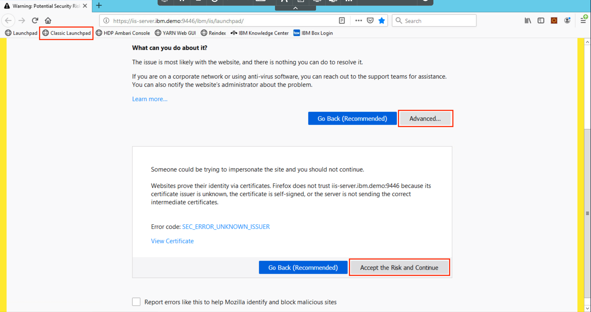
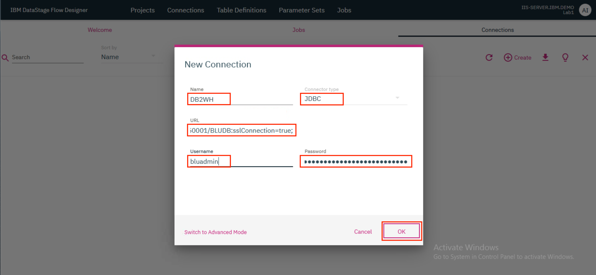
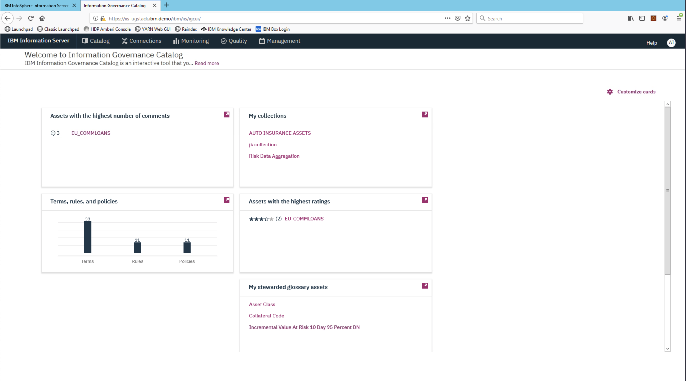

# Lab 4: Analyze data across data sets

Information Server enables users to better understand their data. It uses pre-built and custom rules that will apply meaning and quality measurements, which are available for users of the data and interested parties.

DataStage Flow Designer enables users to create, edit, load, and run DataStage jobs which can be used to perform integration of data from various sources in order to glean meaningful and valuable information.

This lab will give you hands-on experience using Information Server's datastage flow designer and rule capabilities. In this lab, you will learn the following:

* How to join two data sets using DataStage Flow Designer to create a single data set
* How to create a data rule that runs on columns from each data set
* Apply the rules to the joined data set
* View data that does not apply to the rule

This lab is comprised of 2 sections. In the first section, we will see how to associate records within 2 data sets to create a single combined data set using DataStage Flow Designer. In the second section, we will apply a data rule on the combined data set and analyze the data that does not apply to the rule.

> Note: The merged data set is already available in DB2WH. If you wish to, you may skip section 1 and directly move on to section 2 where you can import this merged data set.

This lab consists of the following steps:

[Section 1: Join the data sets](#section-1-join-the-data-sets)
1. [Create a Transformation project](#1-create-a-transformation-project)
1. [Add database connection](#2-add-database-connection)
1. [Create the job](#3-create-the-job)
1. [Compile and run the job](#4-compile-and-run-the-job)
1. [View output](#5-view-output)

[Section 2: Create and run data rule](#section-2-create-and-run-data-rule)
1. [Import and view the data](#1-import-and-view-the-data)
1. [Create a data rule](#2-create-a-data-rule)
1. [Re-analyze and view results](#3-re-analyze-and-view-results)

## Section 1: Join the data sets

## Before you start

Before we start the lab, let's switch to the `iis-client` VM and launch `Firefox`. 


Click on `Classic Launchpad` in the Bookmarks tab. The first time you try this out, you might see a certificate error. To get past it, click on `Advanced...` and then click `Accept the Risk and Continue`.



Click on `DataStage Flow Designer`.


Login with the credentials `isadmin`/`inf0Xerver`.


This brings up the `DataStage Flow Designer`. Click `OK`.


## 1. Create a Transformation project

* On the IBM DataStage Flow Designer, click on the `Projects` tab and click `+ Create`. In the modal that opens up, type in a name for the project and click `Create`.


The project takes a few minutes to be created and once ready, it will be visible on the `Projects` tab.


* Click on the tile for your newly created project. In the modal that opens up, verify that the name of your project is provided as the `Project Name` and click `OK` to switch the project.


## 2. Add database connection

The input tables - `EMP` (containing employee data) and `DEPT` (containing department data) - are already loaded in Db2 Warehouse. Let's add a Db2 warehouse instance as a `Connection` in DataStage.

* Click on the `Connections` tab and then click `+ Create` to add a new connection.


* Provide the following connection details and click `OK`. Click `Save` on the new modal that pops up.

```ini
Name: DB2WH
Connector type: JDBC
URL: jdbc:db2://db2w-kzwbsid.us-east.db2w.cloud.ibm.com:50001/BLUDB:sslConnection=true;
Username: bluadmin
Password: ****************
```



A tile for the new connection will now be displayed in the `Connections` tab.


## 3. Create the job

* Click on the `Jobs` tab and then click `+ Create`. Click `Parallel Job`.


A new tab with the name `Job_1*` opens up where you can now start designing the parallel job.

The first step is to load the input tables `DEPT` and `EMP` into DataStage. The `WORKDEPT` column of the `EMP` table is the same as the `DEPTNO` column of the `DEPT` table.


* First, drag a ***Connection*** connector to the canvas. In the modal that opens up, select the `DB2WH` connection that was created earlier and click `Next`.


* On the next screen, select the `BLUADMIN` schema and click `Next`.


* On the next screen, select the `DEPT` table and click `Next`.


* On the next screen, click `Add to Job`.


* Drag another ***Connection*** connector to the canvas and repeat the steps given above but this time, select the `EMP` table instead. Once you complete the steps, you should see the two ***Connection*** connectors on the canvas.


The `EMP` table uses the `WORKDEPT` column to identify the department number whereas the `DEPT` table uses the `DEPTNO` column. Use a ***Transformer*** stage to modify the output of the `EMP` table by changing the name of the `WORKDEPT` column to `DEPTNO`. This is needed for a future step where we will ***Join*** the two tables.

* Drag and drop a ***Transformer*** stage next to the ***Connection*** connector for the `EMP` table. Provide the output of the `EMP` table ***Connection*** connector as the input to the ***Transformer*** stage. For this, click on the little blue dot on the right side of the ***Connection*** connector and drag the mouse pointer to the ***Transformer*** stage.

**NOTE**: For another method to connect the ***Connection*** connector to the ***Transformation*** stage, click on the ***Connection*** connector to select it, then drag and drop the ***Transformation*** stage. The ***Transformation*** stage will automatically be connected to the ***Connection*** connector.


* Drag and drop a ***Join*** stage to the canvas and provide the output of the ***Transformer*** stage as the input to this ***Join*** stage.


* Double click on the ***Transformer*** stage to open up the stage page. Go to the `Outputs` tab and in the table find the entry for the `WORKDEPT` column. Double click on the `WORKDEPT` value under the `Column name` column and replace the text with `DEPTNO`. Click `OK`.


* Both the tables now have a column called `DEPTNO` which can be used to join the tables. Provide the output of the `DEPT` table ***Connection*** connector as the second input to the ***Join*** stage. Double clicking the ***Join*** stage brings up the stage page where you can verify that the `DEPTNO` is being used as the `JOIN KEY` and the `Join Type` is `Inner`. Click `OK`.


* Drag and drop a ***Connection*** connector to the canvas. In the modal that pops up in the screen, check the box for `Add selected connection as target` and click `Add to Job`. Provide the output of the ***Join*** stage as the input to this connector.


* Double click on the ***Connection*** connector to open up the Properties page on the right. Verify that the URL, username and password are already populated. 


* Scroll down and under the `Usage` section, provide the *Table name* as `<user>_DEPTEMP` where \<user\> is your name, and update the *Table action* to `Replace`. Click `OK`.


## 4. Compile and run the job

* Click the `Save` icon to save the job. If you wish to, you can provide a different name for the job in the modal that pops up. Click `Save`. Once the job is saved, click on the `Compile` icon to compile it. If compilation is successful, you should see a green check mark and the message `Compiled successfully` displayed on the screen.


* Click the `Run` icon to run the job. In the modal that opens up, click `Run`.


## 5. View output

After a successful run, the results will be stored within the DB2WH connection in the `BLUADMIN` schema. Because we specified the *Table action* as `Replace` in the ***Connection*** connector that represents the output, each subsequent run of the job will delete all existing records in the table and replace them with the new output.

* To view the results of the job, double click on the ***Connection*** connector that represents the output. This will open up the Properties page on the right. Click on `View Data` to bring up a modal that shows the contents of the `<user>_DEPTEMP` table in which the output was stored.


**This marks the end of Section 1 of this lab.**

## Section 2: Create and run data rule

## 1. Import and view the data

Switch to the `iis-client` VM and launch `Firefox`. 


* Click on the `Launchpad` bookmark. When the Information Server launchpad shows up click on the `Information Governance Catalog New` tile.


* Log in with the username `isadmin` and password `inf0Xerver`.


* The overview page will appear.



* Click on the `Connections` tab and click `+ Create connections`. 


* On the next screen, provide the following details and click `Test connection` to test the connection. Once successful, click `Save connection`.

```ini
Name: DB2WH
Choose connection: Db2
JDBC URL: jdbc:db2://db2w-kzwbsid.us-east.db2w.cloud.ibm.com:50001/BLUDB:sslConnection=true;
Username: bluadmin
Password: ****************
```


* Now locate the tile for the connection that was just added, click on the kebab icon (⋮) on the tile and click `Discover`.


* Click on `Browse`.


* Expand `db2`. Expand `BLUADMIN` and select the `<user>_DEPTEMP` table where \<user\> is your name. This is the table that was created in section 1 above. If you skipped section 1, then you can select the `SANDHYA_DEPTEMP` table. Click `OK`.


* Under `Discovery options`, select `Analyze data quality`. This will automatically check the boxes for `Analyze columns` and `Assign terms`.


* Scroll to the bottom and select the `Host` as `IIS-SERVER.IBM.DEMO` and the `Workspace` as `UGDefaultWorkspace`. Click `Discover`.


* The discovery process will take some time. Once the assets are discovered, the analysis process will begin. Once that completes, you will be able to see what percentage of records were successfully analyzed.


* Now let us go and have a look at the data. Go to `Quality` tab and click on the tile for `UGDefaultWorkspace`.


* The workspace overview will load. Take a few moments to browse the graphics on the page and click on `Data sets` link to view the data in this exercise.


* Before we create new rules, let's look at the data set that will be used in this lab. Click on the tile for `<user>_DEPTEMP`. 


* Click on the `Columns` tab to view findings from the analyzer. It found many things when the data was imported, like maximum and minimum values, distinct values, format, and uniqueness.


We're now ready to create our first data rule!

## 2. Create a data rule

* From the `UGDefaultWorkspace` workspace, click on the `Data rules` tab.


* Expand `Published Rules` > `08 Validity and Completeness` > `Valid Value Combination`. Find the rule for `IfFieldaIsXThenFieldbGtQty`. Click on the `...` overflow menu on the right and select `Manage in workspace`.


* The rule should now be available under `All`. We will now edit the rule. If you wish to rename the rule, you will first need to `Copy` the rule and you will be provided with the option to rename the rule. Click on the `...` overflow menu of the rule and select `Edit`.


* Switch to the `Rule logic` tab and update the rule to say `IF DEPTNAME = 'OPERATIONS' THEN SALARY > 36000`.


* Next, switch to the `Rule testing` tab. Here you need to bind the variables in the rule logic to specific columns in the data source. Select the `salary` variable in the left table and select the `SALARY` column under *Available data sources*. It should be under `IIS-SERVER.IBM.DEMO` > `db2` > `BLUADMIN` > `<user>_DEPTEMP`. Click on `+ Bind`. The value `<user>_DEPTEMP.SALARY` will now be shown under *Implemented bindings* for the `salary` variable.

* Uncheck the `salary` variable, check the `deptname` variable and bind it with the `DEPTNAME` column under *Available data sources*. As in case of the `SALARY` column, it should be under `IIS-SERVER.IBM.DEMO` > `db2` > `BLUADMIN` > `<user>_DEPTEMP`. Click on `+ Bind`. The value `<user>_DEPTEMP.DEPTNAME` will now be shown under *Implemented bindings* for the `salary` variable.


* Scroll down and click on `Test` to test out the rule. You will see a message at the top of the screen that says the test results can be viewed once ready. When the message disappears, go to the `Rule test results` tab to view the test results.


* You can see that of the 42 total rows, 39 met the rule, and 3 did not. Click on `Did not meet rule conditions` to view the 3 rows. You can see that these rows have `DEPTNAME` = `OPERATIONS` but have `SALARY` < `36000`, and therefore they did not match the rule conditions. Click `Save` to save the rule.


* When you are brought back to the `Data rules` tab, you'll notice that the new rule has an error. We need to publish the rule. To do so navigate to the right to show the `⋯` menu. Choose the `Publish` option from the menu.


* In the modal that pops up, click `Publish` to confirm the publish action.


## 3. Re-analyze and view results

* Go back to the `UGDefaultWorkspace` workspace and click on the `Data sets` link.


* Click on the `<user>_DEPTEMP` data set.


* We can now apply the newly created rule by switching to the `Rules (0)` tab and clicking the `+ Add rule` button.


* Choose the `IfFieldaisXThenFieldbGtQty` rule under `All` and click `Next`.


* As before, we need to bind the rule variables to specific columns in our data set. Select the `salary` variable in the left table and select the `SALARY` column under *Available data sources*. Click on the `+ Bind` button. Once bound, select the `deptname` variable and bind it with the `DEPTNAME` column under *Available data sources*. Once both the variables are bound with the right columns, click `Next`.


* This time, we don't need to test the rule. Simply click `Save`.


* You should now see the rule in the data set view. Click on the `Analyze` button to restart the analysis with the new rule.


* In the modal that pops up, click `Analyze` to confirm analysis.


* The analysis will take a few minutes. You may need to refresh your browser a few times. You will see the state go from `Running` to `Successful` when analysis is complete.


* Once analysis has completed successfully, go to the `Data quality` tab. You'll see that the new rule has six findings - three against DEPTNAME and three against SALARY. Click on either DEPTNAME or SALARY to view the exceptions.


Scrolling to the right you'll see that the three entries shown have `DEPTNAME` = `OPERATIONS` but have `SALARY` less than `36000`, which goes against our rule.


**CONGRATULATIONS!!** You have completed this lab!