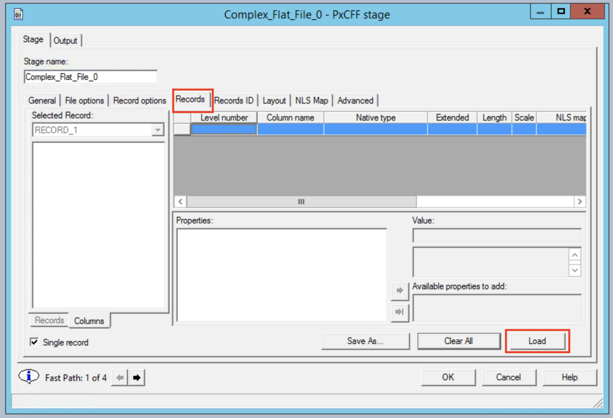

# Lab: Transform EBCIDIC data to CSV with COBOL Copybook

You can use the REST protocols to incorporate IBM DataStage Flow Designer features in your custom application. You use the REST protocol to perform actions such as compiling jobs, running jobs, and getting job status.

The following REST calls are supported:

* XML
* JSON

> For more info check out the [REST API](https://www.ibm.com/support/knowledgecenter/SSZJPZ_11.7.0/com.ibm.swg.im.iis.ds.fd.doc/topics/rest_api.html) documentation.

In this lab we'll learn how to call a JSON endpoint and pipe those results to a file using DataStage.

This lab consists of the following steps:

1. [Create job layout](#1-create-job-layout)
1. [Add COBOL copybook as a table definition](#2-add-cobol-copybook-as-a-table-definition)
1. [Customize the job](#3-customize-the-job)
1. [Compile, run, view output](#4-compile-run-view-output)

## About the data

> To keep things simple in this lab we're going to speak generally about mainframes and COBOL.

Files from a mainframe are usually saved as binary files and sFTPed to some server where DataStage can access them. The binary files alone are not enough for DataStage to read the contents. A COBOL playbook is required to translate the data from binary to ascii. Both files are available here: <https://github.com/IBM/datastage-standalone-workshop/tree/master/data/mainframe>.

The example binary data should be downloaded to the server. Switch to the server and run

```bash
cd /opt/IBM/InformationServer/Server/Projects/dstage1
wget https://raw.githubusercontent.com/IBM/datastage-standalone-workshop/master/data/mainframe/example.bin
```

The copybook can be downloaded to the client machine by going to the [GitHub repo](https://github.com/IBM/datastage-standalone-workshop/blob/master/data/mainframe/copybook.cob) and saving the file to the desktop. The copybook we're using looks like this:

```ini
01  RECORD.
    05  ID                        PIC S9(4)  COMP.
    05  COMPANY.
        10  SHORT-NAME            PIC X(10).
        10  COMPANY-ID-NUM        PIC 9(5) COMP-3.
        10  COMPANY-ID-STR
    05  METADATA.
        10  CLIENTID              PIC X(15).
        10  REGISTRATION-NUM      PIC X(10).
        10  NUMBER-OF-ACCTS       PIC 9(03) COMP-3.
```

## Before you start: Launching DataStage Flow Designer

Before we start the lab, let's switch to the `iis-client` VM and launch `Firefox`.


Launch the desktop client by going to the start menu and searching for `DataStage Designer`.


## 1. Create job layout

Start a new `Parallel Job` project and create a job that looks like the image below. Remember to wire the elements together. It should have:

* 1 x Complex Flat File
* 1 x Peek
* 1 X Sequential File


## 2. Add COBOL copybook as a table definition

In the toolbar click on `Import` > `Table Definitions` > `COBOL File Definitions`.


Specify the downloaded copybook file and click `Import`.


You have just imported your copybook definitions!

## 3. Customize the job

The first step is to double click on the Complex Flat File node, go to the `File options` tab, and specify the example binary file as the input. Critically, we must specify `Fixed block` as the record type.


Go to the `Record options` tab and choose the `Binary` data format and `EBCDIC` as the character set.


Go to the `Records` tab and click the `Load` button, this will give us the option to specify a copybook.



Choose to use on the copybook that was imported in the previous step.


Select the `>>` icon to use all fields from the copybook.


The `Records` tab should now show the various column names from the copybook.


Double clicking on the `Peek` node allows us to map output from the `Complex Flat File`. Click on the `Output` section and choose the `Columns` tab.

Enter the following new columns:

* ID
* SHORT_NAME
* CLIENTID
* COMPANY_ID_NUM
* COMPANY_ID_STR
* REGISTRATION_NUM
* NUMBER_OF_ACCTS
* ACCOUNT_NUMBER
* ACCOUNT_TYPE_X


Still in the `Output` section now click on the `Mapping` tab and choose to `Auto-Match`.


Double clicking on the `Sequential File` node brings up a single option. To specify a filename, choose `mainframe.csv` for example.


## 4. Compile, run, view output

Compile and run the job using the usual icons from the toolbar.

After running the job you can view the output from the Designer tool by clicking on the Sequential File node and clicking the `View Data` button. Click `OK` on the next dialog.


You'll be able to see one row of data with an ID, SHORT_NAME and a few other fields.


The output file is also written to the server. Switch to the server VM by clicking the first icon on the `Environment VMs panel` and selecting `iis-server`. Login as the `root` user with the password `inf0Xerver`.


Change your direcotory using `cd` to the location where you had stored the file.

```bash
cd /opt/IBM/InformationServer/Server/Projects/<project-name>/
```

Finally, output your results using the `cat` command.

```bash
cat mainframe.csv
```


**CONGRATULATIONS!!** You have completed this lab!
