# Lab: Read JSON from a REST call

You can use the REST protocols to incorporate IBM DataStage Flow Designer features in your custom application. You use the REST protocol to perform actions such as compiling jobs, running jobs, and getting job status.

The following REST calls are supported:

* XML
* JSON

> For more info check out the [REST API](https://www.ibm.com/support/knowledgecenter/SSZJPZ_11.7.0/com.ibm.swg.im.iis.ds.fd.doc/topics/rest_api.html) documentation.

In this lab we'll learn how to call a JSON endpoint and pipe those results to a file using DataStage.

This lab consists of the following steps:

1. [Create job layout](#1-create-job-layout)
1. [Customize with Assembly Editor](#2-customize-with-assembly-editor)
1. [Compile and run the job](#3-compile-and-run-the-job)
1. [View output](#4-view-output)

## Before you start: Launching DataStage Flow Designer

Before we start the lab, let's switch to the `iis-client` VM and launch `Firefox`.

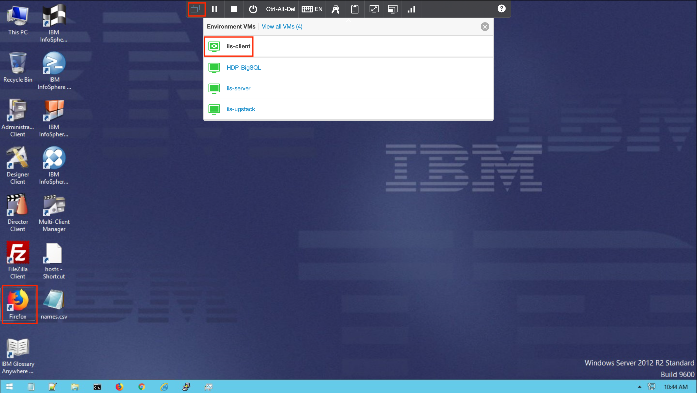

Launch the desktop client `Classic Launchpad`.


## 1. Create job layout

Start a new `Parallel Job` project and create a job that looks like the image below. Remember to wire the elements together. It should have:

* 1 x Hierarchical Data
* 1 x Peek
* 1 X Sequential File

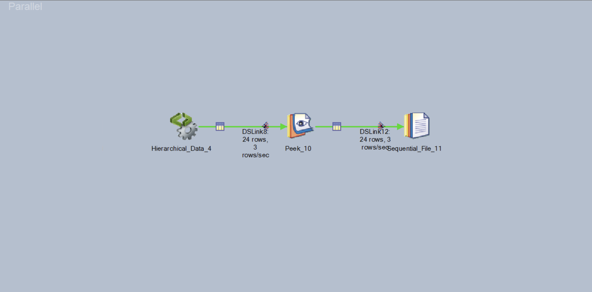

Double click on the `Hierarchical Data` node and click on `Edit assembly`.

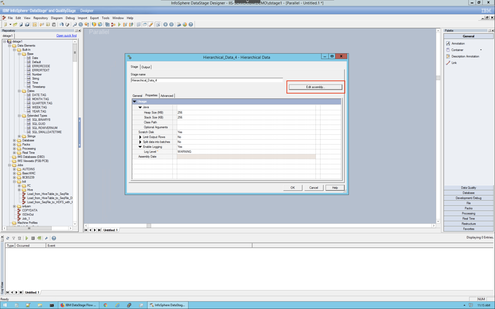

## 2. Customize with Assembly Editor

The "Assembly Editor" will launch. This allows for fine tuning the properties of certain jobs.

Click on `Palette` and add a `REST` step and a `JSON Parser` step.

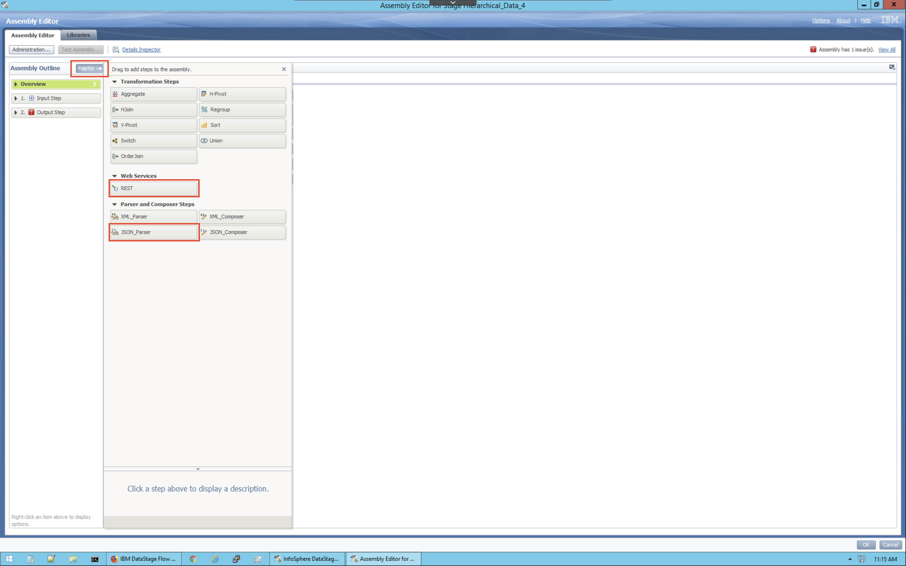

From the `REST` step, in the `General` tab, specify the following URL:

```ini
http://dummy.restapiexample.com/api/v1/employees
```

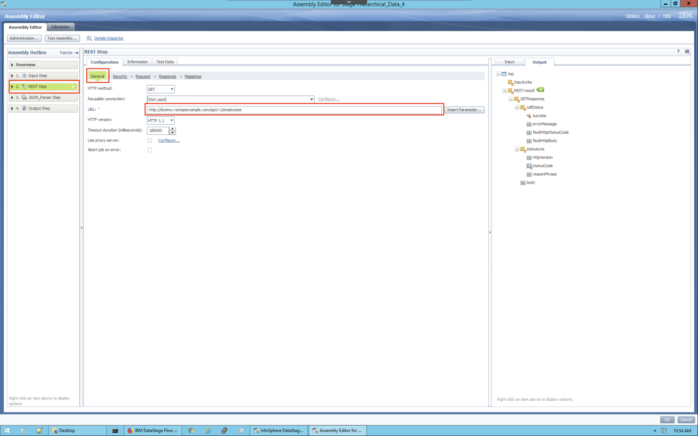

From the `REST` step, in the `Response` tab, specify the content type to be `test/plain`:

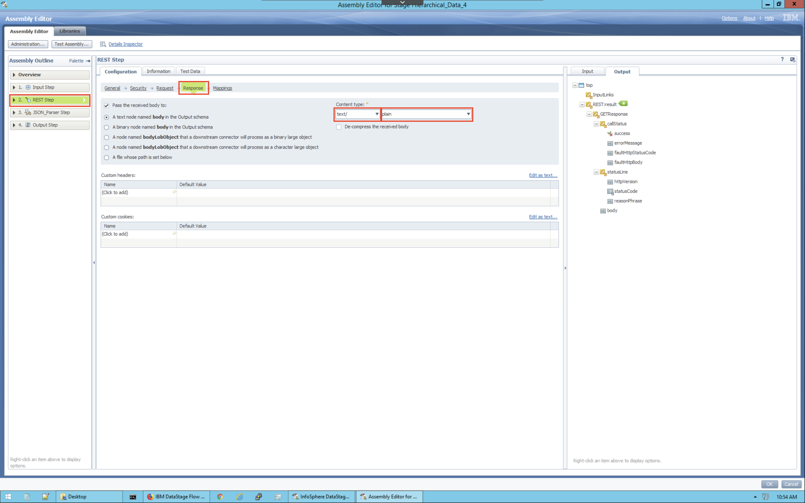

From the `REST` step, in the `Mappings` tab, click on the `Map Automatically` button:

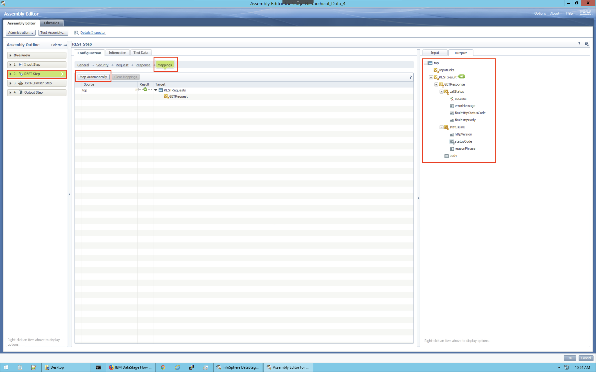

Before proceeding to the `JSON Parser` step click on the `Libraries` button on the top left and choose the `New Library` button.

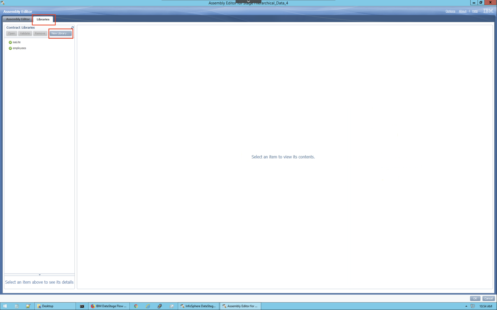

Download the file [`employees.json`](https://raw.githubusercontent.com/IBM/datastage-standalone-workshop/master/data/employees.json) to the desktop.

Click on `Import New Resource` and browse to the newly downloaded file.

DataStage will automatically use this file as a JSON schema

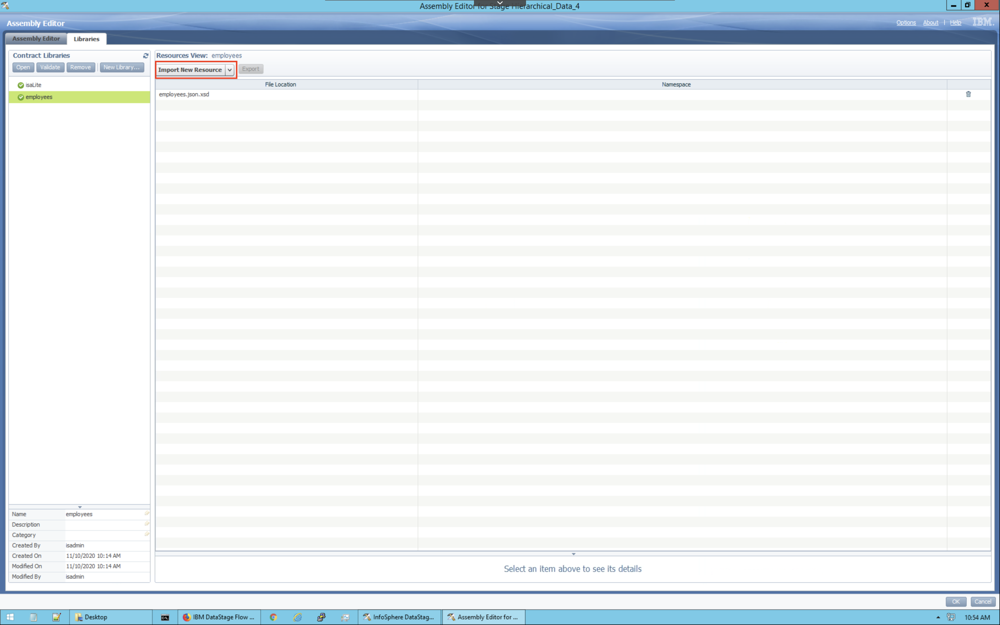

From the `JSON Parser` step, in the `Configuration` tab, choose the `String set` option and use the drop down menu. There is only one result.

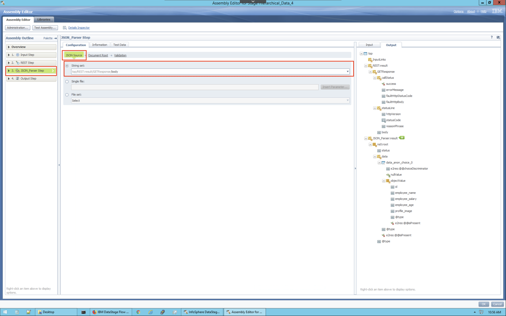

From the `JSON Parser` step, in the `Documentation Root` tab, specify the documentation root to be the new library from the previous step, likely called `employees`.

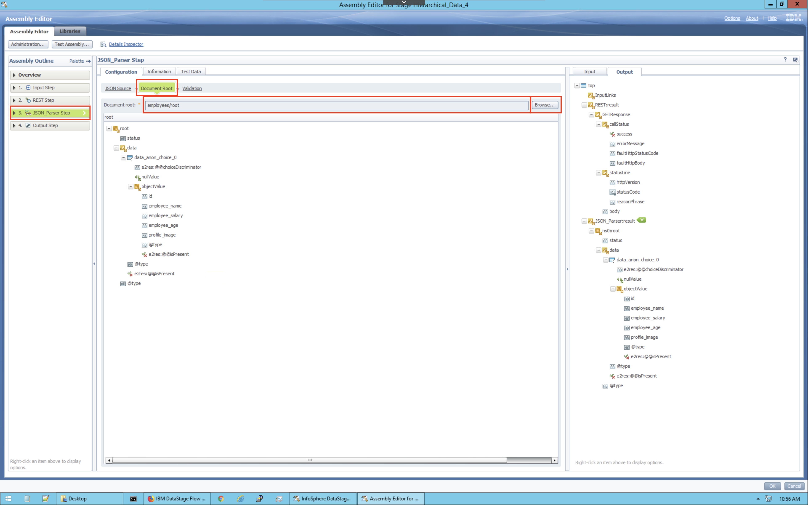

From the `Output` step, in the `Mappings` tab, click on the `Map Automatically` button. Remove the `image profile` and any others you do not want to use.

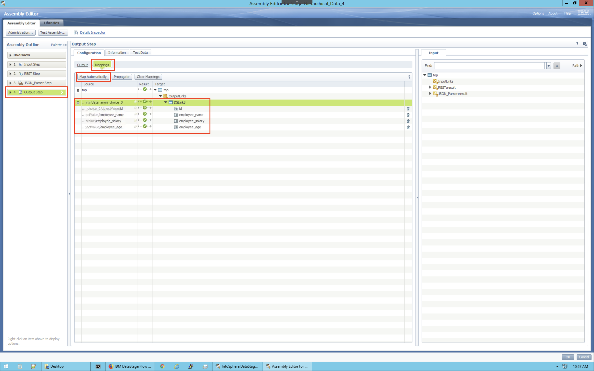

Click `OK` to exit out of the `Assembly Editor`.

## 3. Compile and run the job

Before running the job we need to modify the `Sequential File` by double clicking on its icon on the designer. Specify an output file, say `output.csv`.

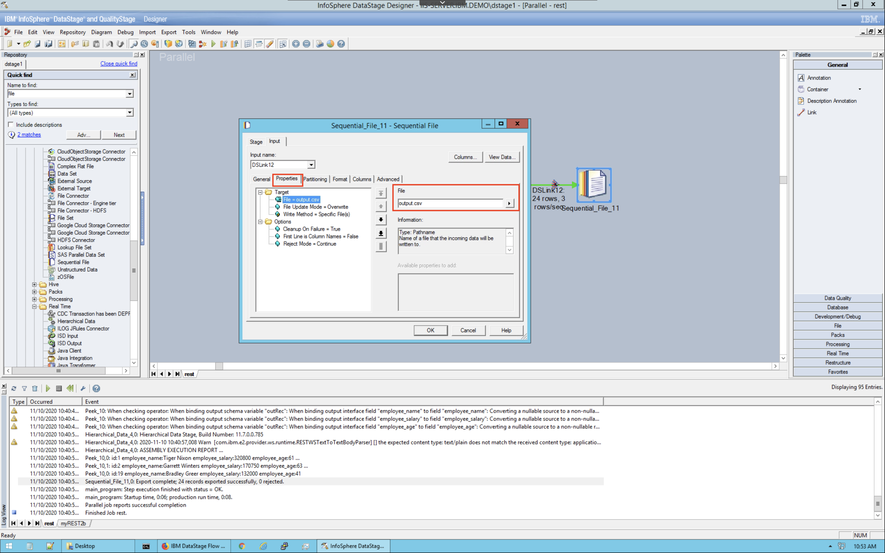

Also update the columns by adding the `id`, `employee_name`, `employee_salary`, and `employee_age` fields.

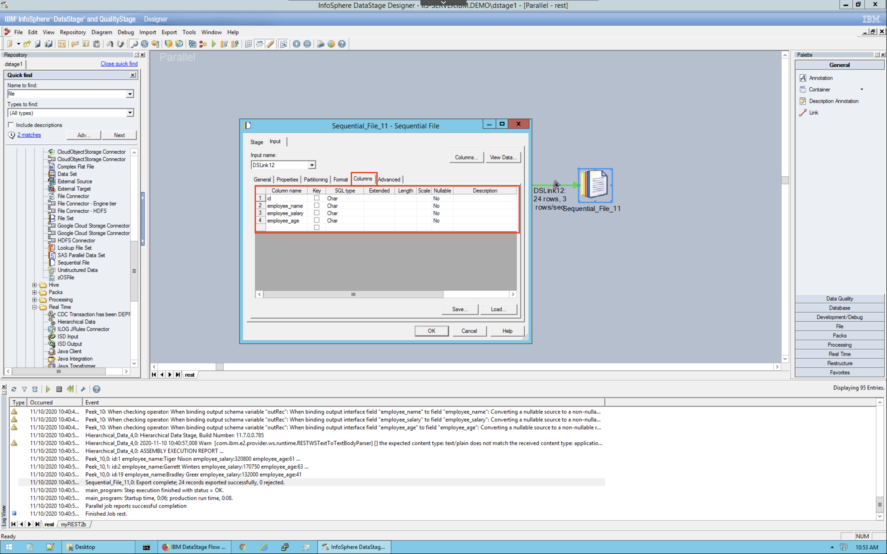

Finally, compile and run the job.

> You may see an error message: `Message bundle error Can't find resource for bundle com.ibm.e2.Bundle_E2_engine_msgs, key OperatorException.operatorTransitionFailedAtRuntime`. To resolve this, go to the `iis-server` machine, go to the temp directory `cd /tmp` and delete the XML files `rm -rf XML*`. This should resolve the issue. Re-compile and re-run the job. For more info check out [IBM support](https://www.ibm.com/support/pages/hierarchical-stage-job-fails-message-bundle-error-cant-find-resource-bundle-comibme2bundlee2enginemsgs-key-operatorexceptionoperatortransitionfailedatruntime).

## 4. View output

The output file will be saved on the server. Switch to the server VM by clicking the first icon on the `Environment VMs panel` and selecting `iis-server`. Login as the `root` user with the password `inf0Xerver`.


Change your direcotory using `cd` to the location where you had stored the file. If you provided a path starting at "/", then it will be stored at that location in the server. Since we had only provided `output.csv` as the file path in the ***File*** connector, the file will be available in the Transformation project's folder, i.e.,

```bash
cd /opt/IBM/InformationServer/Server/Projects/<project-name>/
```

Finally, output your results using the `cat` command.

```bash
cat output.csv
```


**CONGRATULATIONS!!** You have completed this lab!
